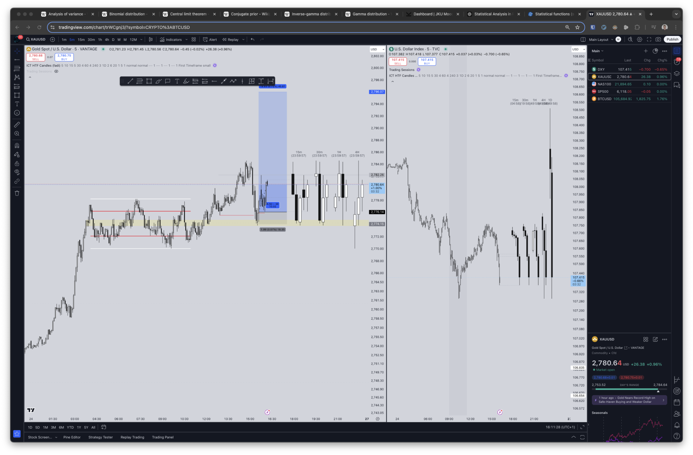

## Notes

I let it run too far despite it hitting my first initial and obvious structure POI TP where i went BE, the BE was then hit, it reversed and went higher. For me the initial setup was already over at this point because we already moved significantly.
I aimed for too much.
Also it was a nice 5m-1h RIMC play as well.

Dollar was trending kind of downwards, but it wasn't really an obvious RIMC more like SC mitigation and trend continuation.

![[m5_3.png]]

Exit at POI vs Exit at high
![[m5_4.png]]

![[h1_1.png]]

![[m1_1.png]]

![[m1_2.png]]

![[m15_1.png]]

![[m30_1.png]]

![[Pasted image 20250125213344.png]]

![[h1_2.png]]

![[h4_1.png]]

![[h4_2.png]]

![[d1_1.png]]

![[w1_1.png]]

![[1M_1.png]]

