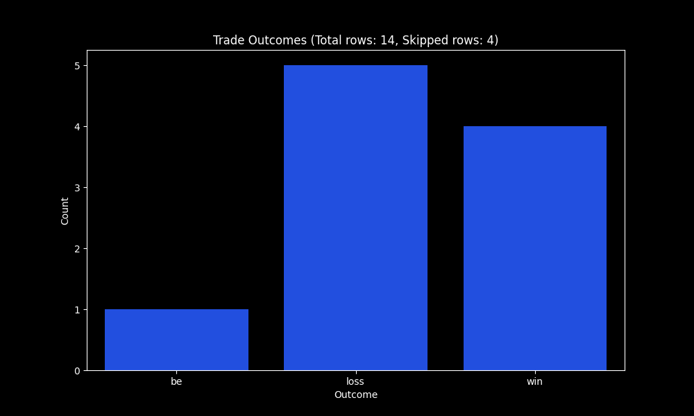
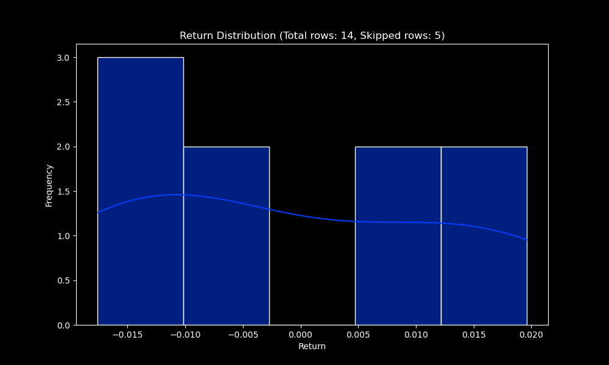

# Trade Journal Index
## Summary Statistics
Trade count: 14

Long trades: 14 (NaNs: 0)

Short trades: 0 (NaNs: 0)

Winrate: 35.71% (NaNs: 6)

Trade expectancy: 0.00 (NaNs: 6)

Total rows: 14

NaNs or skipped values: 28
## Tags Analysis
### Tags Statistics
| tag                               | count | unique_values | missing_values | most_common                   | most_common_freq |
| :-------------------------------- | ----: | ------------: | -------------: | :---------------------------- | ---------------: |
| type_3_d                          |    14 |             1 |              0 | False                         |        0.0714286 |
| sl_price                          |    14 |            13 |              0 | 1.297                         |        0.0714286 |
| type_1_w                          |    14 |             2 |              0 | False                         |        0.0714286 |
| tp_price                          |    14 |            13 |              0 | 1.33                          |        0.0714286 |
| TP_distance                       |    14 |            12 |              0 | 0.010000000000000009          |         0.142857 |
| type_2_h4                         |    14 |             2 |              0 | False                         |        0.0714286 |
| type_2_w                          |    14 |             2 |              0 | False                         |        0.0714286 |
| type_2_m5                         |    14 |             2 |              0 | False                         |        0.0714286 |
| risk_reward_ratio                 |    14 |            13 |              0 | 9.99999999999963              |        0.0714286 |
| type_1_h4                         |    14 |             2 |              0 | False                         |        0.0714286 |
| initial_risk_reward               |    14 |            13 |              0 | 9.99999999999963              |        0.0714286 |
| potential_return                  |    11 |            11 |              3 | 0.011300000000000088          |                1 |
| type_2_m1                         |    14 |             1 |              0 | False                         |        0.0714286 |
| close_price                       |     8 |             8 |              6 | 1.1194                        |                1 |
| type_1_d                          |    14 |             2 |              0 | False                         |        0.0714286 |
| type_1_h1                         |    14 |             1 |              0 | False                         |        0.0714286 |
| entry_price                       |    14 |            13 |              0 | 1.3                           |        0.0714286 |
| type_3_m5                         |    14 |             1 |              0 | False                         |        0.0714286 |
| type_2_m15                        |    14 |             2 |              0 | False                         |        0.0714286 |
| type_1_m15                        |    14 |             1 |              0 | False                         |        0.0714286 |
| type_3_M                          |    14 |             1 |              0 | False                         |        0.0714286 |
| htf_poi_ltf_confirmation          |    14 |             2 |              0 | False                         |         0.142857 |
| type_1_m30                        |    14 |             2 |              0 | False                         |        0.0714286 |
| type_3_m30                        |    14 |             1 |              0 | False                         |        0.0714286 |
| type_1_m5                         |    14 |             1 |              0 | False                         |        0.0714286 |
| type_1_M                          |    14 |             2 |              0 | False                         |        0.0714286 |
| type_2_h1                         |    14 |             2 |              0 | False                         |        0.0714286 |
| session                           |    14 |             2 |              0 | tokyo                         |        0.0714286 |
| type_2_d                          |    14 |             2 |              0 | False                         |        0.0714286 |
| outcome                           |     8 |             2 |              6 | win                           |            0.125 |
| entry_time                        |    14 |            14 |              0 | 2024-12-25T10:00:00.000000000 |                1 |
| potential_price                   |    11 |            11 |              3 | 1.1346                        |                1 |
| type_3_m1                         |    14 |             1 |              0 | False                         |        0.0714286 |
| side                              |    14 |             1 |              0 | long                          |        0.0714286 |
| type_3_w                          |    14 |             1 |              0 | False                         |        0.0714286 |
| type_3_m15                        |    14 |             2 |              0 | False                         |        0.0714286 |
| type_3_h1                         |    14 |             1 |              0 | False                         |        0.0714286 |
| management_strategy               |    14 |             4 |              0 | no_management                 |        0.0714286 |
| numerical_confidence              |    13 |             5 |              1 | 3.0                           |         0.153846 |
| SL_distance                       |    14 |            12 |              0 | 0.008799999999999919          |         0.142857 |
| initial_return                    |    14 |            12 |              0 | 0.010000000000000009          |         0.142857 |
| type_2_M                          |    14 |             2 |              0 | False                         |        0.0714286 |
| type_2_m30                        |    14 |             1 |              0 | False                         |        0.0714286 |
| potential_risk_reward             |    11 |            11 |              3 | 1.4125000000000096            |                1 |
| type_1_m1                         |    14 |             2 |              0 | False                         |        0.0714286 |
| type_3_h4                         |    14 |             1 |              0 | False                         |        0.0714286 |
| return                            |     8 |             8 |              6 | -0.014499999999999957         |                1 |
| htf_poi_ltf_confirmation_False    |    14 |             2 |              0 | False                         |         0.142857 |
| htf_poi_ltf_confirmation_True     |    14 |             2 |              0 | False                         |         0.142857 |
| management_strategy_be_after_1r   |    14 |             2 |              0 | False                         |        0.0714286 |
| management_strategy_be_after_push |    14 |             2 |              0 | False                         |        0.0714286 |
| management_strategy_no_management |    14 |             2 |              0 | False                         |        0.0714286 |
| management_strategy_strategy_2    |    14 |             2 |              0 | False                         |        0.0714286 |
| outcome_loss                      |    14 |             2 |              0 | False                         |        0.0714286 |
| outcome_win                       |    14 |             2 |              0 | False                         |        0.0714286 |
### Tags Distribution
|   sl_price |   tp_price |   TP_distance |   risk_reward_ratio |   initial_risk_reward |   potential_return |   close_price |   entry_price | entry_time                    |   potential_price |   numerical_confidence |   SL_distance |   initial_return |   potential_risk_reward |     return |
|-----------:|-----------:|--------------:|--------------------:|----------------------:|-------------------:|--------------:|--------------:|:------------------------------|------------------:|-----------------------:|--------------:|-----------------:|------------------------:|-----------:|
| 14         | 14         |    14         |           14        |             14        |         11         |     8         |    14         | 14                            |         11        |               13       |    14         |       14         |                11       |  8         |
|  1.15131   |  1.18883   |     0.0303786 |            5.1631   |              5.1631   |          0.0259    |     1.16131   |     1.15845   | 2025-01-08 15:24:34.527686912 |          1.17302  |                3.46154 |     0.0781357 |        0.0303786 |                 4.00473 |  0.0031625 |
|  1.095     |  1.11      |     0.01      |            0.666667 |              0.666667 |          0.0113    |     1.1194    |     1.1       | 2024-12-25 10:00:00           |          1.1346   |                1       |     0.005     |        0.01      |                 1.4125  | -0.0145    |
|  1.11433   |  1.15525   |     0.0233    |            3.04375  |              3.04375  |          0.018     |     1.12375   |     1.12292   | 2025-01-10 20:18:40.198397184 |          1.142    |                3       |     0.00635   |        0.0233    |                 2.76751 | -0.00925   |
|  1.12935   |  1.1708    |     0.03      |            4.46474  |              4.46474  |          0.0233    |     1.1386    |     1.13565   | 2025-01-10 20:18:40.199093504 |          1.166    |                3       |     0.0077    |        0.03      |                 3.39796 |  0.0082    |
|  1.14215   |  1.18885   |     0.038575  |            7.53013  |              7.53013  |          0.0315    |     1.16487   |     1.14907   | 2025-01-10 20:18:40.199151616 |          1.17665  |                5       |     0.00955   |        0.038575  |                 5.33208 |  0.013325  |
|  1.297     |  1.33      |     0.0467    |           10        |             10        |          0.0446    |     1.305     |     1.3       | 2025-01-10 20:18:40.199206    |          1.315    |                5       |     0.5       |        0.0467    |                 6.74194 |  0.0167    |
|  0.0655683 |  0.0643975 |     0.0116951 |            3.00795  |              3.00795  |          0.0109017 |     0.0624231 |     0.0643907 | nan                           |          0.050513 |                1.33012 |     0.178744  |        0.0116951 |                 1.88507 |  0.0127381 |
### Tags Relevance
| tag                               |   count |   winrate |   expectancy |   skipped |   nans |
|:----------------------------------|--------:|----------:|-------------:|----------:|-------:|
| type_3_d                          |      14 |   35.7143 |   0.0031625  |         0 |      0 |
| sl_price                          |      14 |   35.7143 |   0.0031625  |         0 |      0 |
| type_1_w                          |      14 |   35.7143 |   0.0031625  |         0 |      0 |
| tp_price                          |      14 |   35.7143 |   0.0031625  |         0 |      0 |
| TP_distance                       |      14 |   35.7143 |   0.0031625  |         0 |      0 |
| type_2_h4                         |      14 |   35.7143 |   0.0031625  |         0 |      0 |
| type_2_w                          |      14 |   35.7143 |   0.0031625  |         0 |      0 |
| type_2_m5                         |      14 |   35.7143 |   0.0031625  |         0 |      0 |
| risk_reward_ratio                 |      14 |   35.7143 |   0.0031625  |         0 |      0 |
| type_1_h4                         |      14 |   35.7143 |   0.0031625  |         0 |      0 |
| initial_risk_reward               |      14 |   35.7143 |   0.0031625  |         0 |      0 |
| potential_return                  |      11 |   45.4545 |   0.00568571 |         3 |      3 |
| type_2_m1                         |      14 |   35.7143 |   0.0031625  |         0 |      0 |
| close_price                       |       8 |   62.5    |   0.0031625  |         6 |      6 |
| type_1_d                          |      14 |   35.7143 |   0.0031625  |         0 |      0 |
| type_1_h1                         |      14 |   35.7143 |   0.0031625  |         0 |      0 |
| entry_price                       |      14 |   35.7143 |   0.0031625  |         0 |      0 |
| type_3_m5                         |      14 |   35.7143 |   0.0031625  |         0 |      0 |
| type_2_m15                        |      14 |   35.7143 |   0.0031625  |         0 |      0 |
| type_1_m15                        |      14 |   35.7143 |   0.0031625  |         0 |      0 |
| type_3_M                          |      14 |   35.7143 |   0.0031625  |         0 |      0 |
| htf_poi_ltf_confirmation          |      14 |   35.7143 |   0.0031625  |         0 |      0 |
| type_1_m30                        |      14 |   35.7143 |   0.0031625  |         0 |      0 |
| type_3_m30                        |      14 |   35.7143 |   0.0031625  |         0 |      0 |
| type_1_m5                         |      14 |   35.7143 |   0.0031625  |         0 |      0 |
| type_1_M                          |      14 |   35.7143 |   0.0031625  |         0 |      0 |
| type_2_h1                         |      14 |   35.7143 |   0.0031625  |         0 |      0 |
| session                           |      14 |   35.7143 |   0.0031625  |         0 |      0 |
| type_2_d                          |      14 |   35.7143 |   0.0031625  |         0 |      0 |
| entry_time                        |      14 |   35.7143 |   0.0031625  |         0 |      0 |
| potential_price                   |      11 |   45.4545 |   0.00568571 |         3 |      3 |
| type_3_m1                         |      14 |   35.7143 |   0.0031625  |         0 |      0 |
| side                              |      14 |   35.7143 |   0.0031625  |         0 |      0 |
| type_3_w                          |      14 |   35.7143 |   0.0031625  |         0 |      0 |
| type_3_m15                        |      14 |   35.7143 |   0.0031625  |         0 |      0 |
| type_3_h1                         |      14 |   35.7143 |   0.0031625  |         0 |      0 |
| management_strategy               |      14 |   35.7143 |   0.0031625  |         0 |      0 |
| numerical_confidence              |      13 |   38.4615 |   0.0031625  |         1 |      1 |
| SL_distance                       |      14 |   35.7143 |   0.0031625  |         0 |      0 |
| initial_return                    |      14 |   35.7143 |   0.0031625  |         0 |      0 |
| type_2_M                          |      14 |   35.7143 |   0.0031625  |         0 |      0 |
| type_2_m30                        |      14 |   35.7143 |   0.0031625  |         0 |      0 |
| potential_risk_reward             |      11 |   45.4545 |   0.00568571 |         3 |      3 |
| type_1_m1                         |      14 |   35.7143 |   0.0031625  |         0 |      0 |
| type_3_h4                         |      14 |   35.7143 |   0.0031625  |         0 |      0 |
| htf_poi_ltf_confirmation_False    |      14 |   35.7143 |   0.0031625  |         0 |      0 |
| htf_poi_ltf_confirmation_True     |      14 |   35.7143 |   0.0031625  |         0 |      0 |
| management_strategy_be_after_1r   |      14 |   35.7143 |   0.0031625  |         0 |      0 |
| management_strategy_be_after_push |      14 |   35.7143 |   0.0031625  |         0 |      0 |
| management_strategy_no_management |      14 |   35.7143 |   0.0031625  |         0 |      0 |
| management_strategy_strategy_2    |      14 |   35.7143 |   0.0031625  |         0 |      0 |
| outcome_loss                      |      14 |   35.7143 |   0.0031625  |         0 |      0 |
| outcome_win                       |      14 |   35.7143 |   0.0031625  |         0 |      0 |
### Best Single Tags
| tag       |   count |   winrate |   expectancy |
|:----------|--------:|----------:|-------------:|
| type_3_d  |      14 |   35.7143 |    0.0031625 |
| session   |      14 |   35.7143 |    0.0031625 |
| type_3_m1 |      14 |   35.7143 |    0.0031625 |
| side      |      14 |   35.7143 |    0.0031625 |
| type_3_w  |      14 |   35.7143 |    0.0031625 |
### Best Tag Subsets
| tags                                                                                                                                            |   count |   winrate |   expectancy |
|:------------------------------------------------------------------------------------------------------------------------------------------------|--------:|----------:|-------------:|
| ('type_2_w',)                                                                                                                                   |      14 |   35.7143 |    0.0031625 |
| ('type_1_h4', 'management_strategy_be_after_1r', 'htf_poi_ltf_confirmation_False', 'management_strategy_be_after_push', 'type_2_h1')            |      14 |   35.7143 |    0.0031625 |
| ('risk_reward_ratio', 'management_strategy_be_after_1r', 'management_strategy_be_after_push', 'type_1_d', 'management_strategy_be_after_push')  |      14 |   35.7143 |    0.0031625 |
| ('risk_reward_ratio', 'management_strategy_be_after_1r', 'management_strategy_be_after_push', 'type_2_h1', 'type_2_d')                          |      14 |   35.7143 |    0.0031625 |
| ('risk_reward_ratio', 'management_strategy_be_after_1r', 'management_strategy_be_after_push', 'type_2_h1', 'management_strategy_be_after_push') |      14 |   35.7143 |    0.0031625 |
### Selected Features using RFE
type_2_w, risk_reward_ratio, type_1_h4, management_strategy_be_after_1r, htf_poi_ltf_confirmation_False, management_strategy_be_after_push, type_1_d, type_2_h1, type_2_d, management_strategy_be_after_push
## Ignored Tags
m1, m5, m15, m30, h1, h4, d, w, M, numerical_confidence, confidence_1, confidence_2, confidence_3, confidence_4, confidence_5, entry_price, sl_price, tp_price, SL_distance, TP_distance, return, initial_risk_reward, initial_return, potential_risk_reward, potential_return, potential_price, entry_time
## Trades

This plot shows the distribution of trade outcomes (win/loss).

This plot shows the distribution of returns for the trades. The histogram provides a visual representation of the frequency of different return values.
## DataFrame
| trade_uid | type_3_d | sl_price | type_1_w | tp_price | TP_distance | type_2_h4 | type_2_w | type_2_m5 | risk_reward_ratio | type_1_h4 | initial_risk_reward | potential_return | type_2_m1 | close_price | type_1_d | type_1_h1 | entry_price | type_3_m5 | type_2_m15 | type_1_m15 | type_3_M | htf_poi_ltf_confirmation | type_1_m30 | type_3_m30 | type_1_m5 | type_1_M | type_2_h1 | session | type_2_d | outcome | entry_time                 | potential_price | type_3_m1 | side | type_3_w | type_3_m15 | type_3_h1 | management_strategy | numerical_confidence | SL_distance | initial_return | type_2_M | type_2_m30 | potential_risk_reward | type_1_m1 | type_3_h4 |  return | htf_poi_ltf_confirmation_False | htf_poi_ltf_confirmation_True | management_strategy_be_after_1r | management_strategy_be_after_push | management_strategy_no_management | management_strategy_strategy_2 | outcome_loss | outcome_win |
| --------: | :------- | -------: | :------- | -------: | ----------: | :-------- | :------- | :-------- | ----------------: | :-------- | ------------------: | ---------------: | :-------- | ----------: | :------- | :-------- | ----------: | :-------- | :--------- | :--------- | :------- | :----------------------- | :--------- | :--------- | :-------- | :------- | :-------- | :------ | :------- | :------ | :------------------------- | --------------: | :-------- | :--- | :------- | :--------- | :-------- | :------------------ | -------------------: | ----------: | -------------: | :------- | :--------- | --------------------: | :-------- | :-------- | ------: | :----------------------------- | :---------------------------- | :------------------------------ | :-------------------------------- | :-------------------------------- | :----------------------------- | :----------- | :---------- |
|         1 | False    |    1.095 | False    |     1.11 |        0.01 | False     | False    | False     |                 2 | False     |                   2 |              nan | False     |         nan | False    | False     |         1.1 | False     | False      | False      | False    | False                    | False      | False      | False     | False    | False     | tokyo   | False    | nan     | 2025-01-10 20:18:40.198163 |             nan | False     | long | False    | True       | False     | no_management       |                    3 |       0.005 |           0.01 | False    | False      |                   nan | True      | False     |     nan | True                           | False                         | False                           | False                             | True                              | False                          | False        | False       |
|         2 | False    |    1.185 | False    |     1.21 |        0.01 | False     | False    | False     |          0.666667 | False     |            0.666667 |              nan | False     |      1.1855 | False    | False     |         1.2 | False     | False      | False      | False    | True                     | False      | False      | False     | False    | True      | tokyo   | False    | loss    | 2025-01-10 20:18:40.198184 |             nan | False     | long | False    | False      | False     | no_management       |                    2 |       0.015 |           0.01 | False    | False      |                   nan | False     | False     | -0.0145 | False                          | True                          | False                           | False                             | True                              | False                          | True         | False       |
|         3 | False    |    1.297 | False    |     1.33 |        0.03 | False     | False    | False     |                10 | False     |                  10 |              nan | False     |         nan | False    | False     |         1.3 | False     | False      | False      | False    | False                    | False      | False      | False     | False    | False     | london  | False    | nan     | 2024-12-27 10:00:01        |             nan | False     | long | False    | False      | False     | no_management       |                  nan |         0.5 |           0.03 | False    | False      |                   nan | False     | False     |     nan | True                           | False                         | False                           | False                             | True                              | False                          | False        | False       |
|         4 | False    |    1.297 | False    |     1.33 |        0.03 | False     | False    | False     |                10 | False     |                  10 |            0.015 | False     |       1.305 | False    | False     |         1.3 | False     | False      | False      | False    | False                    | False      | False      | False     | False    | False     | london  | False    | win     | 2024-12-25 10:00:00        |           1.315 | False     | long | False    | False      | False     | strategy_2          |                    4 |         0.5 |           0.03 | False    | False      |                     5 | False     | False     |   0.005 | True                           | False                         | False                           | False                             | False                             | True                           | False        | True        |
|         5 | False    |   1.1018 | False    |    1.141 |      0.0294 | False     | False    | False     |                 3 | False     |                   3 |           0.0333 | False     |      1.1248 | True     | False     |      1.1116 | False     | False      | False      | False    | False                    | False      | False      | False     | False    | False     | tokyo   | True     | win     | 2025-01-10 20:18:40.199037 |          1.1449 | False     | long | False    | False      | False     | be_after_1r         |                    3 |      0.0098 |         0.0294 | False    | False      |               3.39796 | False     | False     |  0.0132 | True                           | False                         | True                            | False                             | False                             | False                          | False        | True        |
|         6 | False    |   1.1125 | False    |    1.156 |      0.0347 | False     | False    | False     |           3.94318 | False     |             3.94318 |            0.014 | False     |         nan | False    | False     |      1.1213 | False     | True       | False      | False    | True                     | False      | False      | False     | True     | False     | tokyo   | False    | nan     | 2025-01-10 20:18:40.199063 |          1.1353 | False     | long | False    | False      | False     | no_management       |                    3 |      0.0088 |         0.0347 | False    | False      |               1.59091 | False     | False     |     nan | False                          | True                          | False                           | False                             | True                              | False                          | False        | False       |
|         7 | False    |   1.1256 | False    |    1.155 |      0.0226 | False     | True     | False     |           3.32353 | True      |             3.32353 |           0.0446 | False     |      1.1206 | False    | False     |      1.1324 | False     | False      | False      | False    | False                    | False      | False      | False     | False    | False     | tokyo   | False    | loss    | 2025-01-10 20:18:40.199084 |           1.177 | False     | long | False    | False      | False     | be_after_push       |                    4 |      0.0068 |         0.0226 | False    | False      |               6.55882 | False     | False     | -0.0118 | True                           | False                         | False                           | True                              | False                             | False                          | True         | False       |
|         8 | False    |   1.1411 | False    |   1.1902 |      0.0436 | False     | False    | False     |           7.92727 | False     |             7.92727 |           0.0297 | False     |       1.158 | False    | False     |      1.1466 | False     | False      | False      | False    | True                     | False      | False      | False     | False    | False     | tokyo   | False    | win     | 2025-01-10 20:18:40.199103 |          1.1763 | False     | long | False    | False      | False     | be_after_push       |                    5 |      0.0055 |         0.0436 | True     | False      |                   5.4 | True      | False     |  0.0114 | False                          | True                          | False                           | True                              | False                             | False                          | False        | True        |
|         9 | False    |   1.1328 | False    |   1.1848 |      0.0467 | True      | False    | False     |           8.81132 | False     |             8.81132 |           0.0279 | False     |         nan | False    | False     |      1.1381 | False     | False      | False      | False    | True                     | True       | False      | False     | False    | False     | tokyo   | False    | nan     | 2025-01-10 20:18:40.199122 |           1.166 | False     | long | False    | False      | False     | no_management       |                    5 |      0.0053 |         0.0467 | False    | False      |               5.26415 | False     | False     |     nan | False                          | True                          | False                           | False                             | True                              | False                          | False        | False       |
|        10 | False    |   1.1425 | False    |    1.172 |      0.0221 | False     | False    | False     |           2.98649 | True      |             2.98649 |           0.0233 | False     |         nan | False    | False     |      1.1499 | False     | False      | False      | False    | True                     | False      | False      | False     | False    | False     | tokyo   | False    | nan     | 2025-01-10 20:18:40.199139 |          1.1732 | False     | long | False    | False      | False     | be_after_1r         |                    5 |      0.0074 |         0.0221 | True     | False      |               3.14865 | False     | False     |     nan | False                          | True                          | True                            | False                             | False                             | False                          | False        | False       |
|        11 | False    |   1.1198 | False    |   1.1532 |      0.0254 | False     | False    | False     |             3.175 | False     |               3.175 |           0.0113 | False     |      1.1194 | False    | False     |      1.1278 | False     | False      | False      | False    | True                     | False      | False      | False     | True     | True      | tokyo   | False    | loss    | 2025-01-10 20:18:40.199156 |          1.1391 | False     | long | False    | False      | False     | be_after_push       |                    2 |       0.008 |         0.0254 | False    | False      |                1.4125 | False     | False     | -0.0084 | False                          | True                          | False                           | True                              | False                             | False                          | True         | False       |
|        12 | False    |   1.1048 | True     |   1.1587 |      0.0451 | False     | False    | True      |             5.125 | False     |               5.125 |            0.021 | False     |      1.1273 | False    | False     |      1.1136 | False     | False      | False      | False    | False                    | False      | False      | False     | False    | False     | tokyo   | False    | win     | 2025-01-10 20:18:40.199173 |          1.1346 | False     | long | False    | False      | False     | be_after_1r         |                    5 |      0.0088 |         0.0451 | False    | False      |               2.38636 | False     | False     |  0.0137 | True                           | False                         | True                            | False                             | False                             | False                          | False        | True        |
|        13 | False    |   1.1259 | False    |   1.1696 |      0.0364 | False     | False    | False     |            4.9863 | False     |              4.9863 |            0.023 | False     |      1.1499 | False    | False     |      1.1332 | False     | False      | False      | False    | False                    | True       | False      | False     | False    | False     | tokyo   | True     | win     | 2025-01-10 20:18:40.199190 |          1.1562 | False     | long | False    | False      | False     | no_management       |                    1 |      0.0073 |         0.0364 | False    | False      |               3.15068 | False     | False     |  0.0167 | True                           | False                         | False                           | False                             | True                              | False                          | False        | True        |
|        14 | False    |   1.1376 | True     |   1.1831 |      0.0393 | True      | False    | False     |           6.33871 | False     |             6.33871 |           0.0418 | False     |         nan | False    | False     |      1.1438 | False     | False      | False      | False    | True                     | False      | False      | False     | False    | False     | tokyo   | False    | nan     | 2025-01-10 20:18:40.199206 |          1.1856 | False     | long | False    | False      | False     | be_after_push       |                    3 |      0.0062 |         0.0393 | False    | False      |               6.74194 | False     | False     |     nan | False                          | True                          | False                           | True                              | False                             | False                          | False        | False       |
## Specific Queries
- [Trade 1](trade_1.md)
- [Trade 2](trade_2.md)
- [Trade 3](trade_3.md)
- [Trade 4](trade_4.md)
- [Trade 5](trade_5.md)
- [Trade 6](trade_6.md)
- [Trade 7](trade_7.md)
- [Trade 8](trade_8.md)
- [Trade 9](trade_9.md)
- [Trade 10](trade_10.md)
- [Trade 11](trade_11.md)
- [Trade 12](trade_12.md)
- [Trade 13](trade_13.md)
- [Trade 14](trade_14.md)