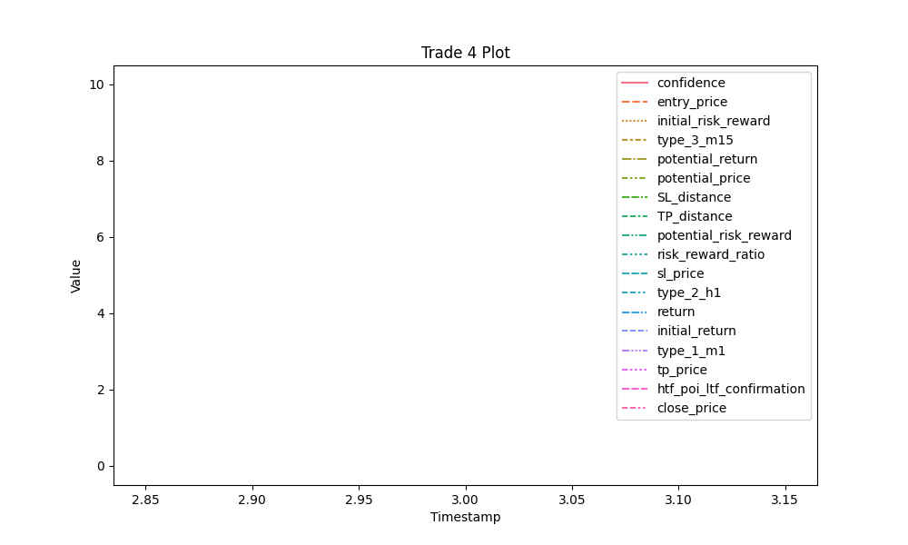

# Trade Summary

**Trade UID:** 4
**Tags:** SL_distance:0.5, entry_price:1.3, sl_price:1.297, tp_price:1.33, SL_distance:0.0030000000000001137, TP_distance:0.030000000000000027, side:long, entry_time:2024-12-25 10:00:00, htf_poi_ltf_confirmation:False, management_strategy:strategy_2, entry_price:1.3, sl_price:1.295, tp_price:1.91, close_price:1.305, SL_distance:0.0050000000000001155, TP_distance:0.6099999999999999, return:0.004999999999999893, side:long, risk_reward_ratio:9.99999999999963, potential_risk_reward:4.999999999999778, potential_return:0.014999999999999902, potential_price:1.315, confidence:4, htf_poi_ltf_confirmation:True, session:london, risk_reward_ratio:9.99999999999963, outcome:win, initial_risk_reward:9.99999999999963, initial_return:0.030000000000000027

[Back to Index](index.md)
